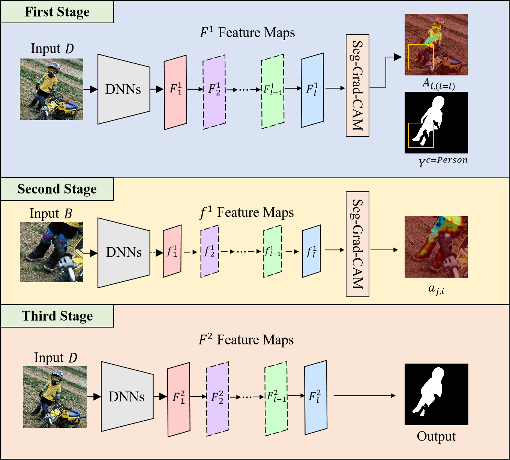
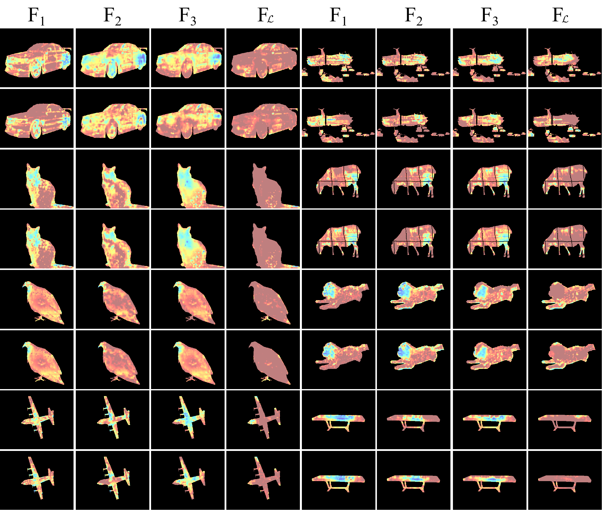
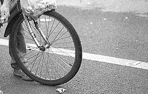
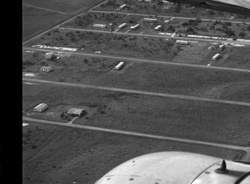

## Selective Integration of Advantaged Features of Slices to Enhance Semantic Segmentation

Yunbo Rao,  Qingsong Lv, Zhanglin Cheng*, Shaoning Zeng

<div align="center">
<br>
	
</div>

## Abstract
> ​	Semantic segmentation has made remarkable advancements in recent years. However, there is still room for improving the utilization of data information in deep neural networks (DNNs). Various approaches have been proposed to enhance the information, including those utilizing slices. However, not all information within the slices contributes effectively to the enhancement, potentially hindering the performance. To address this limitation, we propose the Refine Weak Slice (RWS) method. RWS selectively extracts advantageous features from slices in different convolutional layers and integrates them back into the corresponding layers of DNNs with CNN clusters, aiming to enhance the segmentation accuracy of DNNs. Experimental results demonstrate that integrating the RWS module into state-of-the-art methods significantly improves the average mIoU by 2.9% on benchmark datasets (VOC 2012, COCOStuff, ADE20K, Cityscapes) for both ResNet-101 and ResNet-50. The maximum improvement achieved by a single DNN is 5.8%. Overall, the combination of RWS and DNNs exhibits excellent performance in image segmentation tasks.

## Preparations

#### 1. Download VOC 2012 dataset

```bash
wget http://host.robots.ox.ac.uk/pascal/VOC/voc2012/VOCtrainval_11-May-2012.tar
tar –xvf VOCtrainval_11-May-2012.tar
```

After downloading ` SegmentationClassAug.zip `, you should unzip it and move it to `data/VOCdevkit/VOC2012`. The directory structure should thus be

```
data
└── VOCdevkit
    └── VOC2012
        ├── Annotations
        ├── ImageSets
        ├── JPEGImages
            ├──Action
            ├──Layout
            ├──Main
            └──Segmentation
                ├──train.txt
                ├──val.txt
        ├── SegmentationClass
        └── SegmentationObject
```

We organized the VOC2012 dataset by individual categories. Each class's list of labels and image names are stored separately for training and testing of individual types in `FWM_datalist_20Class`.  

Put the contents of  `train_type_list.txt ` and  `val_type_list.txt ` for each category into  `train.txt ` and  `val.txt ` under ` ./data/VOCdevkit/VOC2012/JPEGImages/Segmentation ` when training the types. Image labels into  `./data/VOCdevkit/VOC2012/SegmentationClass `.

If you want to replace your training dataset, update the image name list in train.txt and val.txt and add the corresponding image labels within the SegmentationClass folders.

#### 2. Clone RWS

```bash
A link to the code will be posted after the review. The code is uploaded as an attachment at this time.
```

#### 3. Download pre-training weights 

* deeplabv3_resnet50: https://download.pytorch.org/models/deeplabv3_resnet50_coco-cd0a2569.pth

* deeplabv3_resnet101: https://download.pytorch.org/models/deeplabv3_resnet101_coco-586e9e4e.pth

  Rename the download weight to ```deeplabv3_resnet50_coco.pth```

  Rename the download weight to ```deeplabv3_resnet101_coco.pth```

  We use deeplabv3_resnet50 as an example in the code.

#### 4. Requirements

```
numpy
Pillow
torch>=1.7.1
torchvision>=0.8.2
ttach
tqdm
opencv-python
matplotlib
scikit-learn
grad-cam
```

### Train

Just Run train.py

### Results

DeepLab v3, PCAA, SC-CAM and RWS have trained on VOC 2012 dataset with the unenhanced dataset and tested on DAVIS 2017.

<div align="center">
<b>Visualization</b>. <i>Left:</i> DeepLab v3. <i>Right:</i> RWS.
<br>
  
  
<div align="center">
<b>Visualization</b>. <i>Left:</i> PCAA. <i>Right:</i> RWS.
<br>
  
  
<div align="center">
<b>Visualization</b>. <i>Left:</i> SC-CAM. <i>Right:</i> RWS.
<br>
  
  


Enhancement effect (mIoU in 15-epoch)

|epoch|  1   |  2   |  3   |  4   |  5   |  6   |  7   |  8   |  9   |  10  |  11  |  12  |  13  |  14  |  15  |
| :--: | :-: | :-: | :-: | :-: | :-: | :-: | :-: | :-: | :-: | :-: | :-: | :-: | :-: | :-: | :-: |
| △mIoU |4.2|5.8|9.7 |-1.3|7.2|5.0|4.4|9.1|6.3|8.8|2.9|8.6|-1.1|3.6|-2.6|


### Guiding DNNs to improve themselves

<div align="center">
<br>
	
</div>

#### 1. Replacement of DNNs

```bash
git clone the code you want to enhance (with CNN clusters)
```

#### 2. Calling all CNN convolutional layers

Modify the convolutional layer called here to be the last convolutional layer of the DLSNs.

```
target_layers = [model.model.backbone.layer4]
```

#### 3. Show the heat map of missing weights for each convolution

Modify line 321 of train.py to be True.

```python
CAM_VIS = True
```

#### 4. Your ablation experiment or new structure replacement

Start your experiments and see how much the convolutional heat map of omega changes for each layer, which can be used to guide your structural improvements. In addition, the converging RoI makes it easier for you to find the bottleneck of the segmentation.

<center>
    
    
    
    
    <center style="text-decoration">Small RoI (Person and Aeroplane)</center>
</center>

